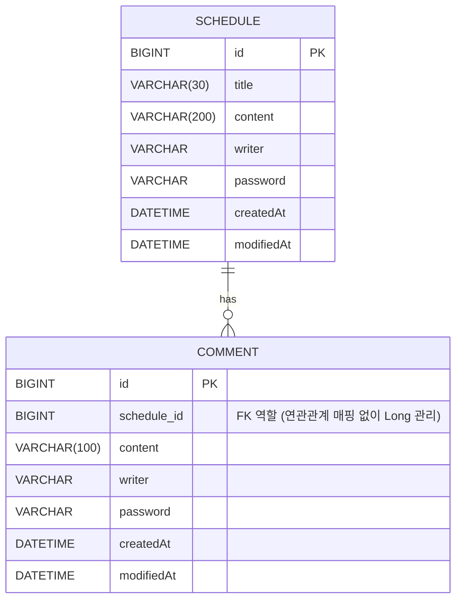

# 📅 ScheduleProject (일정관리 앱 만들기)
## 📝 일정(Schedule) API 명세

| Method | 기능            | Endpoint           | 상태 코드 |
|--------|-----------------|--------------------|-----------|
| POST   | 일정 생성        | `/schedules`       | 201 CREATED |
| GET    | 선택 일정 조회   | `/schedules/{id}`  | 200 OK |
| GET    | 전체 일정 조회   | `/schedules`       | 200 OK |
| PUT    | 일정 수정        | `/schedules/{id}`  | 200 OK |
| DELETE | 일정 삭제        | `/schedules/{id}`  | 204 NO CONTENT |

---

## 1️⃣ 일정 생성 ➕
**POST** `/schedules`

API응답 비밀번호 제외

### ▶ Request
```json
{
  "title": "금요일",
  "content": "내일은 주말이야",
  "writer": "신현민",
  "password": "12345678"
}
```
### ▶ Response (201 CREATED)
```json
{
  "id": 1,
  "title": "금요일",
  "content": "내일은 주말이야",
  "writer": "신현민",
  "createdAt": "2026-02-05T10:00:00",
  "modifiedAt": "2026-02-05T10:00:00"
}
```
## 2️⃣ 선택 일정 조회 🔍
**GET** `/schedules/{id}`

고유 식별자(ID)를 통해 조회

해당 일정에 등록된 댓글들을 포함하여 함께 응답

API응답 비밀번호 제외

### ▶ Response (200 OK)
```json
[
{
  "id": 1,
  "title": "금요일",
  "content": "내일은 주말이야",
  "writer": "신현민",
  "createdAt": "2026-02-05T10:00:00",
  "modifiedAt": "2026-02-05T10:00:00"
}
{
  "id": 1,
  "scheduleId": 1,
  "content": "ㅋㅋ주말엔 알바가야지",
  "writer": "신현민",
  "createdAt": "2026-02-05T12:30:00",
  "modifiedAt": "2026-02-05T12:30:00"
}
]
```
## 3️⃣ 전체 일정 조회 🔍 
**GET** `/schedules`

작성자명을 기준으로 등록된 일정목록 전체 조회

API응답 비밀번호 제외

### 예시 Endpoint
`/schedules`

`/schedules?writer=신현민`

### ▶ Response (200 OK)
```json
[
  {
    "id": 2,
    "title": "월요일",
    "content": "다시 공부해야겠지?",
    "writer": "신현민",
    "createdAt": "2026-02-05T11:00:00",
    "modifiedAt": "2026-02-05T11:00:00"
  }
  {
    "id": 1,
    "title": "금요일",
    "content": "내일은 주말이야",
    "writer": "신현민",
    "createdAt": "2026-02-05T10:00:00",
    "modifiedAt": "2026-02-05T10:00:00"
  },
]
```
## 4️⃣ 일정 수정 ✏️
**PUT** `/schedules/{id}`

선택한 일정 내용 중 일정 제목, 작성자명만 수정 가능

서버에 일정 수정을 요청할 때 비밀번호를 함께 전달

API응답 비밀번호 제외

### ▶ Request
```json
{
  "title": "월요일",
  "writer": "스폰지밥",
  "password": "12345678"
}
```
### ▶ Response (200 OK)
```json
{
  "id": 2,
  "title": "월요일",
  "content": "다시 공부해야겠지?",
  "writer": "스폰지밥",
  "createdAt": "2026-02-05T10:00:00",
  "modifiedAt": "2026-02-05T14:30:00"
}
```
## 5️⃣ 일정 삭제 🗑️
**DELETE** `/schedules/{id}`

서버에 일정 삭제을 요청할 때 비밀번호를 함께 전달

### ▶ Request 
```json
{
 "password":"1234678"
}
```
### ▶ Response 
**(204 NO CONTENT)**

---
## 📝 댓글 생성 API
| Method | 기능    | Endpoint    | 상태 코드       |
| ------ | ----- | ----------- | ----------- |
| POST   | 댓글 생성 | `/comments` | 201 CREATED |
---
## 댓글 생성 ➕
**POST** `/comments`
### ▶ Request
```json
{
  "scheduleId": 1,
  "content": "ㅋㅋ주말엔 알바가야지",
  "writer": "신현민",
  "password": "12345678"
}
```
### ▶ Response(201CREATED)
```json
{
  "id": 1,
  "scheduleId": 1,
  "content": "ㅋㅋ주말엔 알바가야지",
  "writer": "신현민",
  "createdAt": "2026-02-05T12:30:00",
  "modifiedAt": "2026-02-05T12:30:00"
}
```
